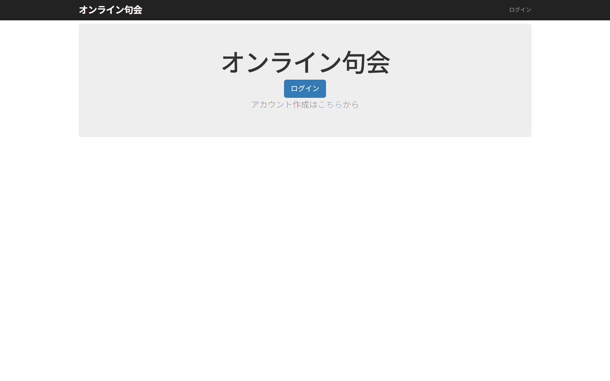
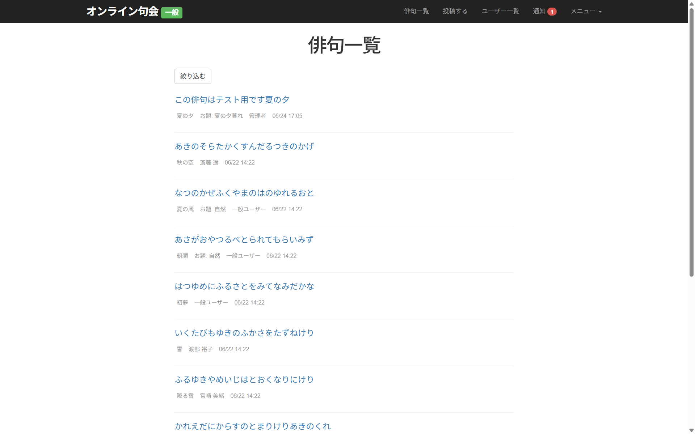
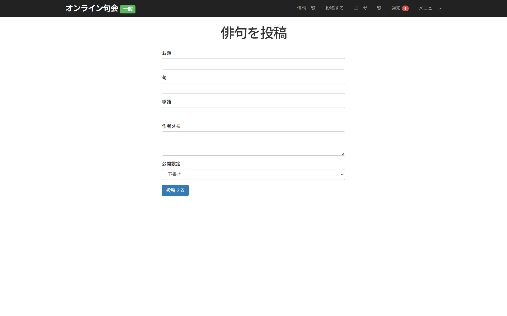
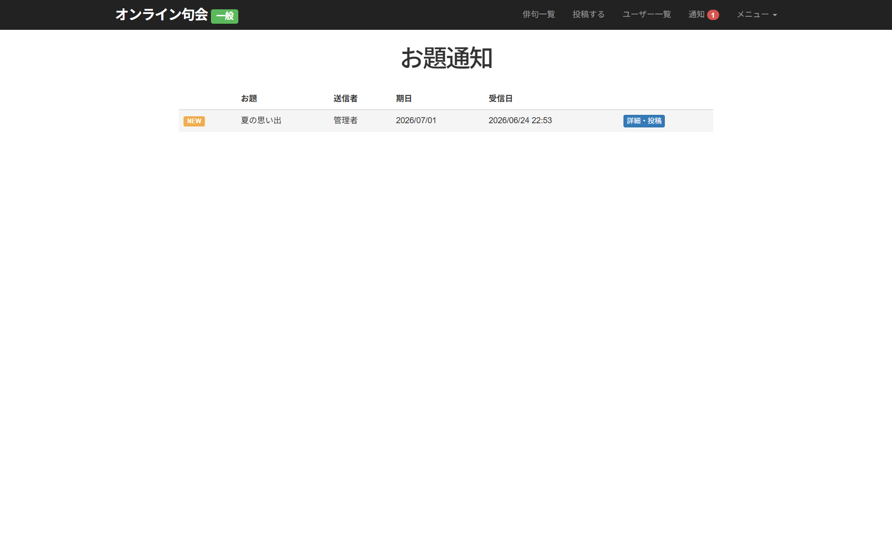
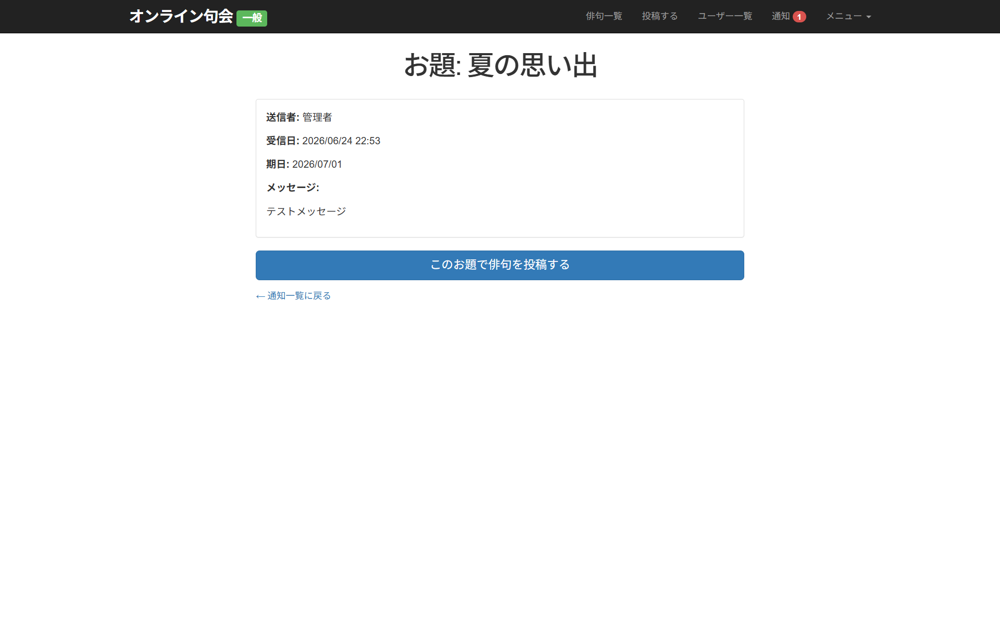
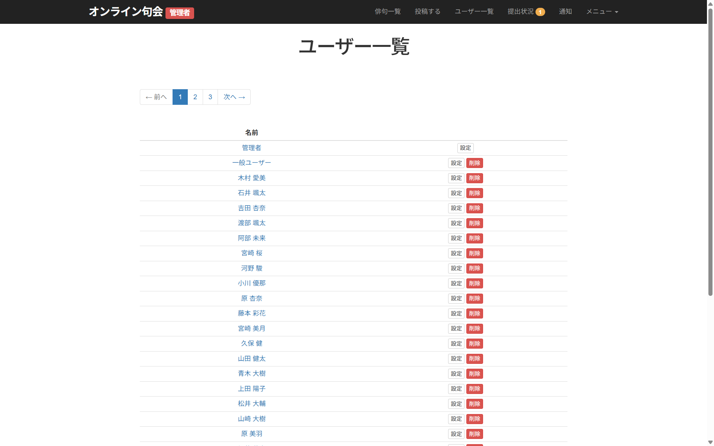
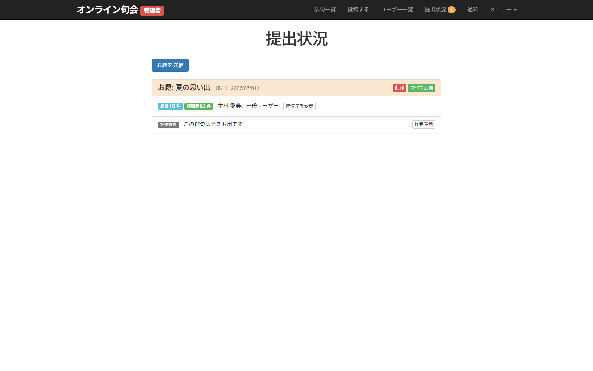
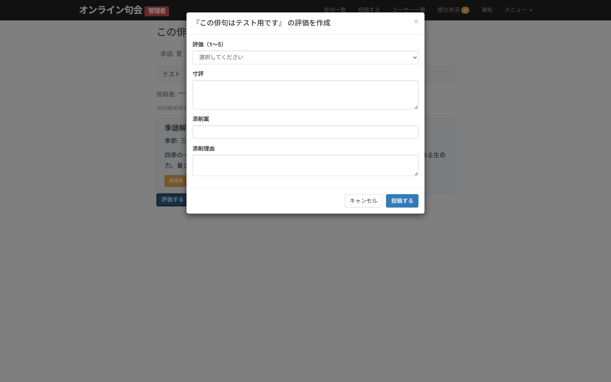

# オンライン句会

俳句の投稿・評価・添削を行うWebアプリケーションです。管理者がお題を出題し、ユーザーが俳句を投稿、管理者が評価・添削するフローを中心に構成されています。

## 制作の背景

趣味の一環として参加している句会において、募集や査定等で手間がかかっている様子があったため、その解決のために制作。

## 使用技術

| カテゴリ       | 技術                                                    |
| -------------- | ------------------------------------------------------- |
| 言語           | Ruby 3.3.0                                              |
| フレームワーク | Rails 7.1                                               |
| フロントエンド | Hotwire (Turbo / Stimulus)、Bootstrap (Sass)、Importmap |
| データベース   | MySQL (開発) / PostgreSQL (本番)                        |
| 外部API        | Gemini API (gemini-2.5-flash) — 季語解説の自動生成      |
| 認証           | bcrypt (has_secure_password)                            |
| テスト         | RSpec、Capybara、Selenium、FactoryBot、WebMock          |
| コード品質     | RuboCop (rails, rspec)                                  |
| サーバー       | Puma                                                    |

## 画面紹介

### トップページ

ログイン・アカウント作成への導線を配置したランディングページです。



### 俳句一覧

公開された俳句を一覧表示します。季語・お題・作者・投稿日時を確認でき、「絞り込む」ボタンからモーダルで部分一致検索が可能です。



### 俳句投稿

お題・句・季語・作者メモを入力して俳句を投稿します。公開設定で「下書き」「公開」などを選択できます。



### お題通知

管理者から届いたお題の通知一覧です。未読のお題には「NEW」バッジが表示され、期日と受信日を確認できます。「詳細・投稿」ボタンからお題への投稿に進めます。



### お題詳細

お題の詳細情報 (送信者・受信日・期日・メッセージ) を確認し、「このお題で俳句を投稿する」ボタンから直接投稿できます。



### ユーザー一覧 (管理者)

管理者がすべてのユーザーを一覧・管理する画面です。ページネーション付きで、各ユーザーの設定変更や削除が行えます (自身の削除は不可)。
一般ユーザーの場合、各ユーザーの公開情報のみ確認が可能。



### 提出状況 (管理者)

お題ごとの提出数・評価済数をバッジで表示し、提出された俳句の評価状況を一目で確認できます。「すべて公開」で評価済みの句を一括公開、「送信先を変更」で対象ユーザーの追加・削除が可能です。



### 評価・添削 (管理者)

モーダルから星評価 (1〜5)・寸評・添削案・添削理由を入力して俳句を評価します。投稿者ブラインド状態で公平な評価が行えます。



## 機能一覧

### ユーザー管理

- ユーザー登録・ログイン・ログアウト (Cookie によるログイン保持)
- プロフィール編集
- マイページ (投句数・管理者評価済数の表示、他ユーザーのページも閲覧可能)
- マイページから「マイ俳句」または他ユーザーの「作成した俳句」一覧へ遷移
- ユーザー一覧 (管理者含む全ユーザー表示、削除は管理者のみ・自身は削除不可)
- 管理者 / 一般ユーザーの権限分離

### 俳句投稿

- 俳句の作成・編集・削除
- 句・季語・お題・作者メモの入力
- 公開設定 (通常投稿: 下書き / 公開、お題経由: 下書き / 管理者へ投稿 / 公開待ち)
- 俳句一覧表示 (ページネーション)
- 絞り込み検索 (お題・作者・句の内容をモーダルからテキスト入力で部分一致検索)
- マイ俳句一覧 (テキスト形式でのエクスポート)

### 管理者フロー

- お題の出題 (複数ユーザーへ一括送信、期日設定付き、モーダルから操作)
- 提出状況ページ (お題ごとに期日・送信先ユーザー・提出数・評価済数をバッジで一覧表示)
- 提出状況カード内に評価待ち・公開待ちの句を表示、クリックで俳句の評価ページへ遷移 (ホバー時ハイライト)
- 投稿者ブラインド (「作者表示」ボタンで切替)
- ヘッダー背景色による状態識別 (評価待ちあり: 薄オレンジ / 全員公開待ち＋期日超過: 薄水色)
- 送信先ユーザーの変更 (モーダルから追加・削除)
- 「すべて公開」ボタンで公開待ちの句を一括公開 (評価待ちが残っている場合はエラー、公開後にお題を自動削除)
- お題の一括削除 (評価待ち・公開待ちの句は下書きに戻す)
- 管理者評価後に俳句を「公開待ち」状態に変更 (即公開ではなく一括公開を待つ)
- 同一お題につき管理者へ投稿できる句は1つまで (再投稿時は既存の句を下書きに戻して差し替え)

### 通知 (お題)

- 管理者からのお題通知の受信・一覧表示
- お題への期日設定 (初期値: 1週間後、過去日付のバリデーション)
- 期日超過時の赤字警告表示
- 未読バッジ表示 (管理者へ投稿した時点で既読化)
- 管理者評価完了時に通知を自動削除
- 通知からの俳句投稿 (お題固定、投稿先を下書き / 管理者へ投稿に限定)

### 評価・添削

- 星評価 (1〜5) と寸評の投稿（モーダルから操作）
- 添削案・添削理由の記入
- 評価の編集・削除（モーダルから操作）
- 1俳句につき1ユーザー1評価の制約
- 自分の俳句への評価不可
- 管理者評価はカード先頭に固定表示・背景色で強調
- 管理者評価済みの俳句は編集不可 (削除は可能)
- 管理者が評価投稿後、句が「公開待ち」になった場合は提出状況ページへ自動遷移
- 管理者が「公開待ち」の句の評価を削除した場合、句を「管理者へ投稿」に差し戻し
- 「公開待ち」の句の管理者評価は句の作者に非表示 (公開まで評価内容を伏せる)

### 季語解説 (AI)

- Gemini API による季語の自動解説
- 季節の細分類・親季語・子季語の表示
- 解説結果のDBキャッシュ (同一季語の再問い合わせ不要)
- Turbo Frame による非同期読み込み

### その他

- 投稿者ブラインド表示 (ボタンで表示切替)
- レスポンシブ対応 (Bootstrap)
- 日本語ローカライズ (rails-i18n)

## ER図 (主要テーブル)

```
users
├── haikus (1:N)
│   └── reviews (1:N)
├── reviews (1:N)
├── topic_assignments (1:N)  ※受信者
└── topic_assignments (1:N)  ※送信者 (sender_id)

kigo_explanations (季語解説キャッシュ)
```

## セットアップ

```bash
git clone https://github.com/YoshitatsuSaita/portfolio_ruby
cd portfolio_ruby
bundle install
bin/rails db:create db:migrate db:seed
bin/rails server
```

環境変数:

| 変数名           | 用途                                 |
| ---------------- | ------------------------------------ |
| `GEMINI_API_KEY` | Gemini API キー (季語解説機能に必要) |

## 設計上のこだわり

・投稿された句を匿名性を保ったまま評価できるようにするため、自ら確認しようとしない限り作者名を表示できないように記載。
・当初は句の文脈から季語を読み取らせる方式にしたかったが、俳句では表記方法が多種多様な故にgeminiでは対応は不可能と判断。季語の欄を別に作成し、その季語の意味を読み取らせる方針に変更。

## 今後の展望

・お題に応じてランキング機能の作成
・ユーザーのスコアに応じて属性分け、評価フォームの変更
